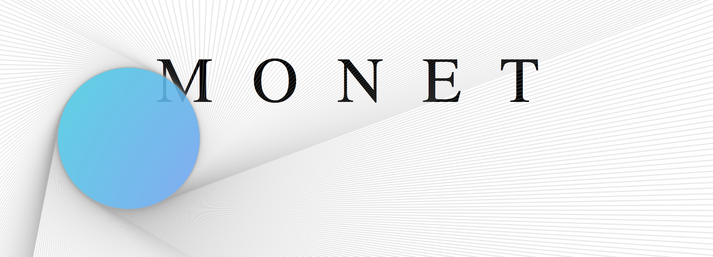

A web editor for mixed pixel-svg graphical effects.

### Setup

Note: this project uses Scala 3, and so will need an SBT version >= 1.5.0

```
npm install             // Adds `three`,`nlopt`,etc.
sbt
> ~fastOptJS            // Compiles to JS and watches for changes
```

`index.html` can then be loaded in any browser or served locally.

---

Note: `webpack` was also used in creating the bundled file `dist/main.js`, which includes the external JS modules into the global scope such that they may be used from ScalaJS ([reference](https://github.com/scala-js/scala-js/issues/2175)). Ideally this does not have to be re-done except in the case that a new dependency is added (though this is why the `package.json` includes browser polyfills for all the core NodeJS modules that our dependencies use).

In the unfortunate occurrence that the bundle needs to be regenerated (e.g. because a dependency is added), run:

```
npx webpack // may require installing [npx](https://www.npmjs.com/package/npx)
```

and fix all of the dependency polyfill errors by adding lines to `resolve.fallback` object in `webpack.config.js`. Subsequently, add the following line to `index.js`:

```
window.$PACKAGE = require('$PACKAGE')
```

where $PACKAGE is the name of the dependency.

<!-- Monet runs entirely on the front-end using [Scala JS](https://www.scala-js.org/). We use the [Mill](http://www.lihaoyi.com/mill/) build tool for Scala, which must be installed first. One ce this is done, we run:

```
npm install             // Adds esbuild dependency for minification
mill minifier --watch   // Compiles frontend using scala.js
```

DC: I would like to use Mill again eventually (easier to script against) but for now the project is small enough that it doesn't matter.
-->
